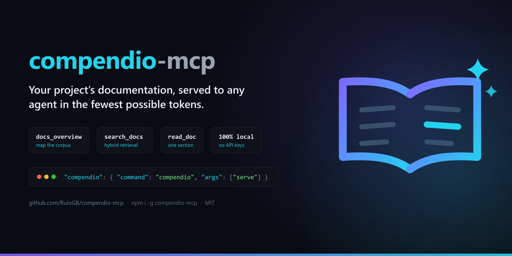

<p align="center">
  
</p>

<p align="center">
  <strong>Your project's documentation, served to any agent in the fewest possible tokens.</strong><br>
  <em>A local RAG retrieval layer exposed as an MCP server. Your agent stops grepping and dumping whole files — it reaches the right paragraph instead.</em>
</p>

<p align="center">
  <a href="https://www.npmjs.com/package/compendio-mcp"></a>
  <a href="LICENSE"></a>
  <a href="https://nodejs.org"></a>
  
</p>

<p align="center">
  <a href="https://lobehub.com/mcp/rulogb-compendio-mcp"></a>
</p>

<p align="center">
  <a href="#what-compendio-does">What it does</a> &bull;
  <a href="#requirements">Requirements</a> &bull;
  <a href="#quick-start">Quick Start</a> &bull;
  <a href="#configuration">Configuration</a> &bull;
  <a href="#mcp-tools">MCP Tools</a> &bull;
  <a href="#cli">CLI</a> &bull;
  <a href="#how-it-works">How it works</a> &bull;
  <a href="#incremental-sync">Incremental sync</a> &bull;
  <a href="#multilingual">Multilingual</a> &bull;
  <a href="docs/documentation-convention.md">Full docs</a>
</p>

---

## The problem

Your agent doesn't know your documentation. So it does what it can: `grep`, then `cat` a 400-line file to answer a question that lived in one paragraph. Three files later the context window is full of noise and the answer is still a guess.

Attaching the whole `docs/` folder doesn't fix it — it just moves the waste earlier. Neither does keyword search: nobody writes questions using the exact words the document uses.

## What Compendio does

Compendio indexes your markdown documentation and gives any AI agent three tools to find and read exactly what it needs.

- 🔍 **Hybrid retrieval, not grep** — keyword search finds the exact term, semantic search finds the paraphrase. Compendio runs both and merges the results.
- ✂️ **Token-frugal by design** — orient for ~10 tokens per document, search for a handful of fragments, read a single section. Never the whole corpus.
- 🔒 **100% local** — one SQLite file, embeddings on CPU, zero network calls at query time. No API keys, no Docker, no services, nothing leaves your machine.
- ♻️ **Stays current** — a running server picks up your documentation edits on its own. No watcher process, no manual rebuild loop.
- 🗣️ **Multilingual** — index documentation in any language. The embeddings model is multilingual and search is diacritic-insensitive. See [Multilingual](#multilingual).
- 🧩 **Zero configuration** — works on *any* folder of `.md` files. No required frontmatter, no config file. An optional [documentation convention](#documentation-convention-optional) is there if your team already has a taxonomy to enforce.

## Requirements

- Node.js ≥ 22.12.
- Nothing else.

## Quick start

**1. Install it.**

```bash
npm install -g compendio-mcp
```

To update Compendio later, run that same command again — it always pulls the latest published version.

**2. Register it as an MCP server** in your client, pointed at your project root.

**Claude Code** (`.mcp.json` at the repo root):

```json
{
  "mcpServers": {
    "compendio": {
      "command": "compendio",
      "args": ["serve"]
    }
  }
}
```

**OpenCode** (`opencode.json`):

```json
{
  "mcp": {
    "compendio": {
      "type": "local",
      "command": ["compendio", "serve"],
      "enabled": true
    }
  }
}
```

**VS Code / Copilot** (`.vscode/mcp.json`):

```json
{
  "servers": {
    "compendio": {
      "type": "stdio",
      "command": "compendio",
      "args": ["serve"]
    }
  }
}
```

**Cursor** (`.cursor/mcp.json`):

```json
{
  "mcpServers": {
    "compendio": {
      "command": "compendio",
      "args": ["serve"]
    }
  }
}
```

**Codex** (`.codex/config.toml`):

```json

[mcp_servers.compendio]
command = "npx"
args = ["compendio-mcp", "serve"]
enabled = true
startup_timeout_sec = 60

```

**3. Build the index once**, from the project root:

```bash
compendio index
```

That's it. By default Compendio reads `docs/` at the project root — no config file needed. Add `.compendio/` to your `.gitignore`.

> **Why this step exists.** The server also indexes on startup, so strictly speaking you could skip it — but the first run downloads and caches the embeddings model (tens of MB), and whoever triggers it waits. Running it here pays that cost in your terminal, with a progress bar, instead of inside your agent's first tool call. From then on everything is offline, and the index keeps itself up to date ([below](#incremental-sync)).

> **Windows note.** Some MCP clients can't spawn the `compendio.cmd` shim directly. If the server fails to start with `ENOENT`, use `"command": "npx"` with `"args": ["compendio-mcp", "serve"]`.

## Configuration

Entirely optional — every field has a default, and Compendio works with no config file at all. Create `compendio.config.json` at your project root only to override what you need:

```json
{
  "docsDir": ["docs"],
  "exclude": ["INDEX.md"],
  "db": ".compendio/compendio.db",
  "embeddings": { "provider": "local", "model": "Xenova/multilingual-e5-small" },
  "chunk": { "minTokens": 100, "maxTokens": 480 },
  "search": { "k": 5 },
  "sync": { "throttleMs": 30000 },
  "convention": {
    "mode": "loose",
    "excludedStatuses": [],
    "frontmatterFields": { "type": "type", "module": "module", "status": "status" }
  }
}
```

| Key | What it's for |
|---|---|
| `docsDir` | One or more documentation roots, relative to the project root. Always an array — there is no single-string form. Defaults to `["docs"]` |
| `exclude` | Entries to skip when indexing: an exact path, a bare filename (matched anywhere), or a directory prefix (e.g. `"adr/superseded"` skips everything under it) |
| `db` | Where the SQLite index file is written |
| `search.k` | Default number of fragments returned per search |
| `chunk` | Fragment size bounds, in tokens |
| `sync.throttleMs` | Minimum time between automatic sync passes, in ms (30000 = 30 s). A floor, not a timer — gates only `serve`'s automatic triggers, not a manually-run `compendio sync` — see [Incremental sync](#incremental-sync) |
| `convention` | Optional documentation taxonomy — see below |

Declaring only part of the `convention` block merges with the defaults field by field; it never wipes the siblings you didn't mention. `frontmatterFields` maps `type`/`module`/`status` onto non-standard frontmatter keys (e.g. `{ "status": "estado" }` reads a Spanish document's `estado:` field as `status`).

Every numeric key (`search.k`, `chunk.minTokens`, `chunk.maxTokens`, `sync.throttleMs`) is honored only when it is a finite number greater than 0 — `search.k` must additionally be a whole number. Anything else, including a quoted number like `"480"`, falls back to the default exactly as an absent key would, and the fallback is reported: on stderr for every CLI command, and in `docs_overview`'s response for an MCP client. An unrecognized key under `embeddings`, `chunk` or `convention.frontmatterFields` (a typo such as `maxtokens`) is reported the same way. A config with nothing wrong reports nothing.

### Multiple documentation roots

Declare more than one root to index several folders — `adr/`, `rfcs/`, a spec directory — as one searchable corpus:

```json
{ "docsDir": ["docs", "openspec"], "exclude": ["INDEX.md", "openspec/changes/archive"] }
```

Every document `path` is prefixed with its root's alias — the directory's own name, so `docs/x.md` and `openspec/specs/y.md` both read as the real project-relative path. This holds with a single root too, including the zero-config default: `docs/x.md`, not `x.md`. `search_docs`, `docs_overview`, `read_doc` and the generated `INDEX.md` all use this prefixed shape; passing a `path` back to `read_doc` exactly as returned always resolves.

Declared roots may not collide: two roots resolving to the same directory, one nested inside another (in either declaration order), or two roots sharing the same directory name (and therefore the same alias) are all rejected before anything is indexed. A root that is declared but cannot be read (a typo, or a folder only some checkouts have) is reported and skipped — the run continues on the remaining roots, and only throws if every declared root fails. Removing a root from `docsDir` deletes its documents on the next sync pass, same as deleting the files themselves would.

`--dir <path>` (below) replaces the whole declared root set with that one directory — it does not add to it.

### Documentation convention (optional)

Two modes, selected by `convention.mode`:

- **`loose`** (default, zero-config) — never rejects a file for missing metadata. The title comes from the first H1 (falling back to a humanized filename), the module is inferred from the folder, and `type`/`status` are read from frontmatter when present and left absent otherwise.
- **`strict`** (opt-in) — a linter: every document needs an H1 and non-empty `type`/`module`/`status`, validated against the lists your project declares. Files that fail are skipped and reported, never breaking the run.

```jsonc
{
  "convention": {
    "mode": "strict",
    "types": ["functional", "adr", "api", "qa", "guide"],
    "statuses": ["draft", "current", "deprecated"],
    "excludedStatuses": ["draft", "deprecated"]
  }
}
```

`excludedStatuses` hides documents from search by lifecycle state — drafts and deprecated pages stop polluting results. See [`docs/documentation-convention.md`](docs/documentation-convention.md) for the full convention this repository's own docs follow.

## MCP tools

Designed as *progressive disclosure*: orient cheaply → search cheaply → read only what is needed.

**1. `docs_overview()`** — the corpus map. Counts by type and module, plus one line per document. Roughly **10 tokens per document**.

**2. `search_docs({ query, type?, module?, tags?, k?, include_excluded? })`** — the top *k* fragments (5 by default, at most 2 per document), each with path, section, excerpt and score. `type` is an open, project-defined string, not a fixed list.

**3. `read_doc({ path, section? })`** — one section, or the whole document. A path that doesn't exist returns the 3 most similar paths instead of an error, so the agent self-corrects instead of retrying blind.

## CLI

| Command | What it does |
|---|---|
| `compendio serve` | Starts the MCP server over stdio |
| `compendio index` | Full rebuild of the index |
| `compendio sync` | Runs one incremental sync pass from the terminal — syncs only the documents whose content changed, with live progress. See [Incremental sync](#incremental-sync) |
| `compendio search "..."` | Hybrid search with filters: `--type`, `--module`, `--tags`, `-k`, `--all` |
| `compendio overview` | Map of the indexed corpus |
| `compendio index-md` | Generates or updates one combined `INDEX.md` in the first declared root (`docs/INDEX.md` by default) — one line per document, across every declared root |
| `compendio eval` | Measures retrieval quality against a goldenset |

Global option `-C, --root <dir>`: project root. Add `--lexical` to `index`, `sync` or `search` to skip embeddings entirely. `--dir <path>` on `index`/`index-md` **replaces** the configured `docsDir` with that one directory — it does not add to it, and the index it produces still has the prefixed path shape (`<dirname>/x.md`). `sync` has no `--dir`: under an incremental pass, dropping a root this way would delete its documents rather than merely skip them (see `compendio sync --help`).

## How it works

```
docs/**/*.md
     │
     ├─▶ split into fragments at heading boundaries, then bounded to maxTokens
     │
     ├─▶ index each fragment twice ─┬─ full-text (keywords)
     │                              └─ embeddings (meaning)
     │
     └─▶ one file: .compendio/compendio.db
```

At query time both indexes are searched independently and their rankings are merged with **Reciprocal Rank Fusion** — a rank-based merge with no weights to tune blindly. The agent gets back the smallest set of relevant fragments.

Compendio is the **retrieval** half of RAG. It never calls an LLM and generates nothing: it finds the right paragraphs and gets out of the way.

If the embeddings model is unavailable, Compendio doesn't crash — it degrades to keyword-only search and says so in its responses.

## Incremental sync

Documentation changes while you work, and Compendio keeps up on its own — or on request. There are four ways the index gets refreshed:

| Trigger | What happens |
|---|---|
| **Server startup** (`compendio serve`) | One incremental sync pass, started before the transport connects. The first tool call waits for it, so nothing is ever answered against a cold index |
| **Any MCP tool call** (`search_docs`, `docs_overview`, `read_doc`) | One incremental sync pass — but only if **30 s** have elapsed since the last one (`sync.throttleMs`, `30000` by default). Otherwise the call proceeds against the current index |
| **`compendio sync`** | One incremental sync pass, run manually from the terminal, with live progress. `sync.throttleMs` does **not** gate it — every invocation runs a fresh pass regardless of how recently one ran. A failure exits non-zero instead of being logged and swallowed, since there is no "proceed against the current index" fallback for a command whose whole point is a definitive answer |
| **`compendio index`** | Full rebuild from scratch: the index is dropped and recreated |

**It is not a timer.** There is no background interval and no file watcher. Syncing is driven by your agent's tool calls, or by you running `compendio sync`, and the throttle is a *floor* between the two automatic triggers, not a schedule: a server nobody is querying does not sync, and a burst of ten calls in one second still triggers at most one pass. Concurrent calls join the pass already running instead of starting a second one.

Each incremental sync pass compares content hashes against what's already indexed, so only new, changed and deleted documents do any work — an unchanged corpus costs nothing. Inside `serve`, if a pass fails it's logged to stderr and the tool still answers against the current index; `compendio sync` has no such fallback, so the same failure exits the process non-zero.

**When you need the full rebuild.** `compendio index` is the only command that reindexes: it drops and recreates the whole database, and it is the authoritative one. Reach for it after a large restructuring, if you suspect the index has drifted, or — the case that surprises people — after changing `chunk.minTokens`/`chunk.maxTokens`. An incremental sync pass, whether automatic or run manually via `compendio sync`, fingerprints a document by its content hash alone, so a document you haven't edited keeps its old fragment boundaries no matter what the config now says. Only a full reindex (`compendio index`) applies new chunking to unchanged files — see `compendio sync --help` for the same caveat at the point you're most likely to need it.

## Multilingual

Write your documentation in whatever language your team works in. Compendio doesn't care:

- **The contract is English, the corpus doesn't have to be.** Tool parameters (`path`, `type`, `module`, `tags`, `section`), response fields and tool descriptions are English, so any agent reads them without friction. That is independent of what language your documents are written in: frontmatter keys are stripped before indexing, and the FTS5 tokenizer carries no language-specific stemmer.
- **Non-English frontmatter keys map back.** If your documents use `estado:` instead of `status:`, `convention.frontmatterFields` translates them.
- **Accents are handled properly.** Search is diacritic-insensitive, so *validación* and *validacion* match. Accent-sensitive search silently loses results.
- **The embeddings model is multilingual** (`Xenova/multilingual-e5-small`), so single-language and mixed-language corpora index and retrieve alike.

The reference corpus and evaluation set shipped in `ejemplos/` are Spanish — deliberately, as proof that an English codebase and tool contract retrieve non-English documentation without loss.

## How much does semantics add over grep?

Measured with `compendio eval` on the example corpus (`ejemplos/`: 11 documents, 29 chunks, **no config file** — the zero-config path itself) and its goldenset of 22 real questions:

| mode | recall@5 | MRR | failures |
|---|---|---|---|
| **hybrid** | **1.00** | **0.943** | **0** |
| keyword-only | 0.95 | 0.856 | 1 |

- Keyword search is already strong when the question uses the corpus terminology.
- The gap opens on paraphrases and synonyms: *«¿Qué endpoint hay que llamar para crear un lead?»* falls out of the top 5 without embeddings, and the semantic leg recovers it. Questions with zero word overlap with the matching document are solved *only* by semantics.
- Speed: with the model warm, hybrid search answers in **5–20 ms**.

`compendio eval` reproduces this table at any time — it's also the instrument for tuning chunking and `k` without guessing.

## Architecture

Hexagonal: the core knows nothing about SQLite, transformers.js, or the filesystem.

```
src/
├── domain/            # pure, no dependencies: model, chunking, ranking, convention policy
├── application/       # use cases
├── infrastructure/    # adapters: SQLite, markdown parsing, filesystem, embeddings
├── composition.ts     # composition root — start here to see the whole app
├── cli.ts             # input adapter: commander
└── server.ts          # input adapter: MCP server (stdio)
```

Every external dependency sits behind a port in `src/domain/ports.ts`. Swapping the vector store or the embeddings provider is a local change in one adapter, not a rewrite.

## Development

```bash
npm install
npm run build       # compiles to dist/
npm test            # vitest: domain, adapters and integration
npm run typecheck   # tsc --noEmit
npm run dev -- ...  # CLI without compiling (tsx)
```

Integration tests use a deterministic embeddings provider (no downloads) against the real `ejemplos/` corpus.

Try the CLI against the bundled example corpus without installing the package:

```bash
node dist/cli.js --root ejemplos index
node dist/cli.js --root ejemplos search "¿cuándo se considera duplicado un lead?"
```

This repository ships a `.mcp.json` that serves the `ejemplos/` corpus, so you can try the tools from Claude Code with zero configuration.

## License

MIT © Raúl García Barciela
